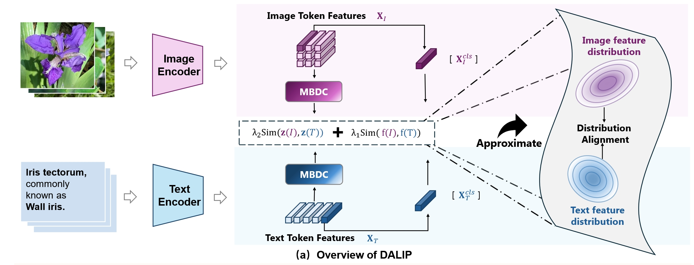

# DALIP: Distribution Alignment-based Language-Image Pre-Training for Domain-Specific Data
## Abstract
Recently, Contrastive Language-Image Pre-training (CLIP) has shown promising performance in domain-specific data (e.g., biology), and has attracted increasing research attention. Existing works generally focus on collecting extensive domain-specific data and directly tuning the original CLIP models. Intuitively, such a paradigm takes no full consideration of the characteristics lying in domain-specific data (e.g., fine-grained nature of biological data) and so limits model capability, while mostly losing the original ability of CLIP in the general domain. In this paper, we propose a Distribution Alignment-based Language-Image Pre-Training (DALIP) method for biological data. Specifically, DALIP optimizes CLIP models by matching the similarity between feature distribution of image-text pairs instead of the original [cls] token, which can capture rich yet effective information inherent in image-text pairs as powerful representations, and so better cope with fine-grained nature of biological data. Particularly, our DALIP efficiently approximates feature distribution via its first- and second-order statistics, while presenting a Multi-head Brownian Distance Covariance (MBDC) module to acquire second-order statistics of token features efficiently. Furthermore, we collect a new dataset for plant domain (e.g., specific data in biological domain) comprising 10M plant data with 3M general-domain data (namely PlantMix-13M) according to data mixing laws. Extensive experiments show that DALIP clearly outperforms existing CLIP counterparts in biological domain, while well generalizing to remote sensing and medical imaging domains. Besides, our PlantMix-13M dataset further boosts performance of DALIP in plant domain, while preserving model ability in general domain.
## Methodology

*a) Overview of our Distribution Alignment-based Language-Image Pre-Training (DALIP) method for biological data. Specifically, DALIP optimizes CLIP models by matching the similarity between feature distribution of image-text pairs, which are efficiently approximated by first- and second-order statistics of token features. Particularly, (b) a Multi-head Brownian Distance Covariance (MBDC) module is presented to efficiently acquire second-order statistics of token features.*

## Dataset

The PlantMix-13M dataset will be publicly available soon. This dataset contains:
- 10M plant domain images and text pairs
- 3M general domain images and text pairs
- Carefully curated according to data mixing laws

## Acknowledgments

This project is built upon the [OpenCLIP](https://github.com/mlfoundations/open_clip) codebase. We sincerely thank them for their outstanding contribution to the open-source community.

